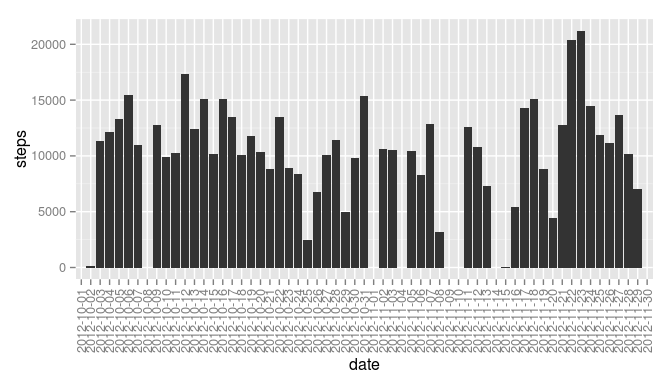
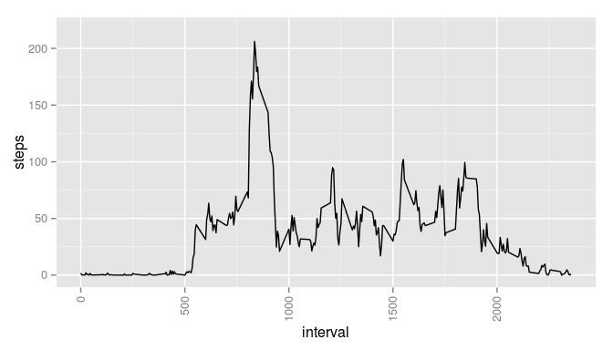
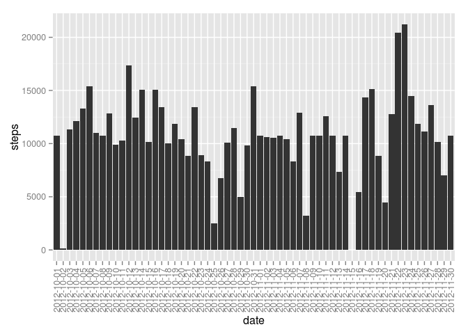
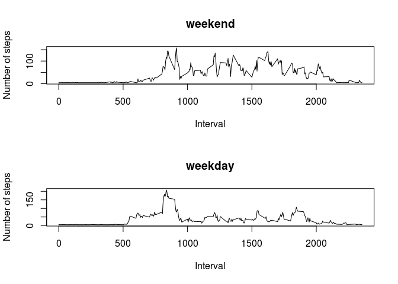

# Reproducible Research: Peer Assessment 1


## Loading and preprocessing the data

```r
activity_data <- read.csv("activity.csv")
```


## What is mean total number of steps taken per day?
### Total number of steps taken each day

```r
library(data.table)
library(ggplot2)
dt <- data.table(activity_data)
steps_by_day <- dt[,list(steps=sum(steps)), by='date']
ggplot(steps_by_day, aes(x=date, y=steps))+geom_bar(stat='identity', position='dodge')+theme(axis.text.x=element_text(angle=90,hjust=1,vjust=0.5))
```

 

### Mean total number of steps taken each day

```r
mean(activity_data$steps, na.rm=TRUE)
```

```
## [1] 37.3826
```

### Median total number of steps taken each day

```r
median(activity_data$steps, na.rm=TRUE)
```

```
## [1] 0
```

## What is the average daily activity pattern?
### Time series of 5-minute interval and average number of steps across all days

```r
steps_by_interval <- dt[,list(steps=mean(steps, na.rm=TRUE)), by='interval']
ggplot(steps_by_interval, aes(x=interval, y=steps, ymax=max(steps)*1.05))+geom_line(stat='identity', position='dodge')+theme(axis.text.x=element_text(angle=90,hjust=1,vjust=0.5))
```

 

### 5-minute interval which contains the maximum number of steps (on average across all days)

```r
steps_by_interval[steps == max(steps_by_interval$steps)]$interval
```

```
## [1] 835
```


## Imputing missing values
### Total number of missing values in the dataset

```r
colSums(is.na(activity_data))
```

```
##    steps     date interval 
##     2304        0        0
```

### Total number of steps taken each day with missing values filled

```r
new_data <- activity_data
mean_steps <- mean(new_data$steps, na.rm=TRUE)
new_data$steps[is.na(new_data$steps)] <- mean_steps
dt <- data.table(new_data)
steps_by_day <- dt[,list(steps=sum(steps)), by='date']
ggplot(steps_by_day, aes(x=date, y=steps))+geom_bar(stat='identity', position='dodge')+theme(axis.text.x=element_text(angle=90,hjust=1,vjust=0.5))
```

 

### Mean total number of steps taken each day

```r
mean(new_data$steps, na.rm=TRUE)
```

```
## [1] 37.3826
```

### Median total number of steps taken each day

```r
median(new_data$steps, na.rm=TRUE)
```

```
## [1] 0
```

Using the mean value of steps across all days to fill in the missing values in the dataset had no impact on the mean or median values for the total daily number of steps.


## Are there differences in activity patterns between weekdays and weekends?

```r
is_weekday <- function(x) {
  if (x %in% c("Saturday","Sunday")) 
  {
    ret <- "weekend"
  } 
  else 
  {
    ret<- "weekday"
  }
  ret
}
new_data$day_type <- lapply(weekdays(as.Date(new_data$date)), is_weekday)
weekend_sub <- subset(new_data, day_type=="weekend")
weekday_sub <- subset(new_data, day_type=="weekday")
par(mfrow=c(2,1))
weekend_dt <- data.table(weekend_sub)
weekday_dt <- data.table(weekday_sub)
steps_by_interval_weekend <- weekend_dt[,list(steps=mean(steps, na.rm=TRUE)), by='interval']
steps_by_interval_weekday <- weekday_dt[,list(steps=mean(steps, na.rm=TRUE)), by='interval']

plot(steps_by_interval_weekend$interval, steps_by_interval_weekend$steps, type="l", ylab="Number of steps", xlab="Interval", main="weekend")

plot(steps_by_interval_weekday$interval, steps_by_interval_weekday$steps, type="l", ylab="Number of steps", xlab="Interval", main="weekday")
```

 
